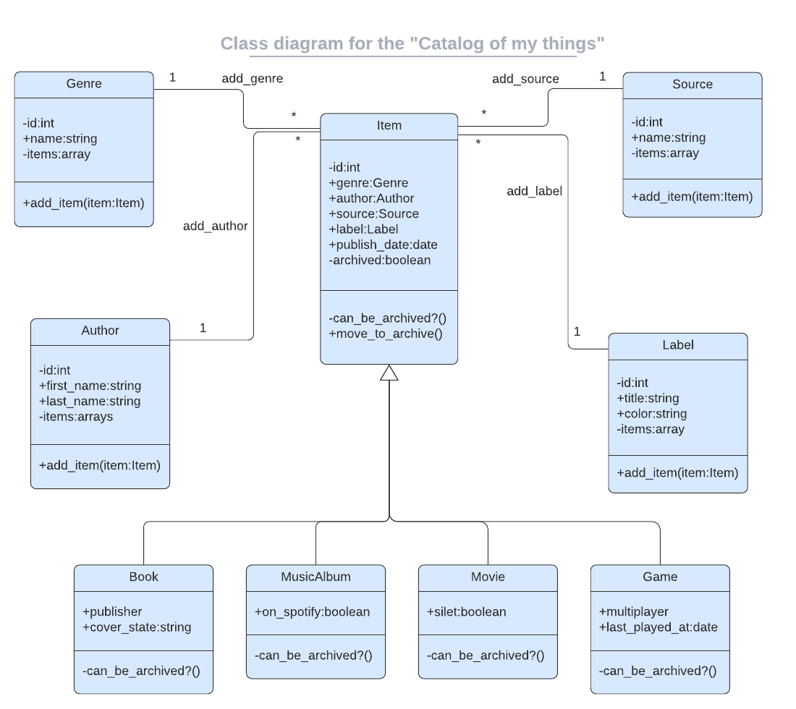

<p align="center">
  <a href="https://www.microverse.org/">
    
  </a>
  <a href="https://github.com/Hamzaoutdoors/Catalog-Of-My-Things/blob/dev/LICENSE.md">
    
  </a>
  <a href="https://github.com/Hamzaoutdoors/Catalog-Of-My-Things">
    
  </a>
  <a href="https://github.com/Hamzaoutdoors/Catalog-Of-My-Things">
    
  </a>
  <a href="https://github.com/Hamzaoutdoors">
    
  </a>
</p>

<div align="center">
       </div>

   </br>
 <div align="center">
  <em align="center" style>" Everyday life is like programming, I guess. If you love something you can put beauty into it."</em><strong> - Sabrina Bryan</strong>
  </div>
   </br>

# Ruby Group Capstone : Catalog of my things

# 📗 Table of Contents

- [📖 About the Project](#about-project)
  - [🛠 Built With](#built-with)
    - [Tech Stack](#tech-stack)
    - [Key Features](#key-features)
- [💻 Getting Started](#getting-started)
  - [Setup](#setup)
  - [Prerequisites](#prerequisites)
- [👥 Authors](#authors)
- [🔭 Future Features](#future-features)
- [🤝 Contributing](#contributing)
- [⭐️ Show your support](#support)
- [🙏 Acknowledgements](#acknowledgements)
- [📝 License](#license)

<!-- PROJECT DESCRIPTION -->

# 📖About the Project <a name="about-project"></a>

In this project, we create a console app that will help you to keep a record of different types of things you won:

- **Books**
- **Music albums**
- **Games**

Everything will be based on the UML class diagram presented below. The data will be stored in JSON files, furthermore, we prepared a database with tables structure analogical to the program's class structure.

<!--
</br>
 <div align="center">
   <kbd>
    
    <p>Catalog of my things Console App</p>
   </kbd>
</div>
-->

</br>
 <div align="center">
    
    <p>UML class diagram of Catalog of my things project</p>
</div>

## 🛠 Built With <a name="built-with"></a>

### Tech Stack <a name="tech-stack"></a>

- Ruby 
- PostgreSQL 

<!-- Features -->

### Key Features <a name="key-features"></a>

- Add, list and preserve books, music albums, movies, games data.
- Basic UI.

<p align="right">(<a href="#readme-top">back to top</a>)</p>

<!-- GETTING STARTED -->

## 💻 Getting Started <a name="getting-started"></a>

To get a local copy up and running, follow these steps.

## Install

### Clone the repository

```shell
git clone https://github.com/hienphan0111/catalog-of-thing.git
cd catelog-of-thing
```

### Check your Ruby version

```shell
ruby -v
```

The ouput should start with something like `ruby 3.2.2`

If not, install the right ruby version using [rbenv](https://github.com/rbenv/rbenv) (it could take a while):

```shell
rbenv install 3.2.2
```

### Install dependencies

Using [Bundler](https://github.com/bundler/bundler) and [Yarn](https://github.com/yarnpkg/yarn):

```shell
bundle install
```

or

```shell
yarn install
```

### run program demo

```shell
ruby main.rb
```

### run test

To run a single Rspec test file, you can do the following to run the tests in the `your_spec.rb` file:

```shell
rspec spec rspec/your_spec.rb
```

To run all Rspec test files in a directory

```shell
rspec spec rspec
```

<p align="right">(<a href="#readme-top">back to top</a>)</p>

<!-- AUTHORS -->

## 👥 Authors <a name="authors"></a>

👤 **Hien Phan**

- GitHub: [hienphan0111](https://github.com/hienphan0111)
- Twitter: [hienphan0111](https://twitter.com/hienphan0111)
- LinkedIn: [mr-hienphan](https://www.linkedin.com/in/hien-phan-61097b256/)

👤 **Stanley Kibor**

- GitHub: [Stanley Kibor](https://github.com/chepkok3)
- Twitter: [Stanley Kibor](https://twitter.com/@stanleykibor3)
- LinkedIn: [Stanley Kibor](https://www.linkedin.com/in/......)

👤 **Alice Mirigo**

- GitHub: [Alice Mirigo](https://github.com/alicemirigo92)
- Twitter: [Alice Mirigo](https://twitter.com/......)
- LinkedIn: [Alice Mirigo](https://www.linkedin.com/in/alice-mirigo/)

<p align="right">(<a href="#readme-top">back to top</a>)</p>

<!-- FUTURE FEATURES -->

## 🔭 Future Features <a name="future-features"></a>

- Movies and source features

<p align="right">(<a href="#readme-top">back to top</a>)</p>

<!-- CONTRIBUTING -->

## 🤝 Contributing <a name="contributing"></a>

Contributions, issues, and feature requests are welcome!

Feel free to check the [issues page](../../issues/).

<p align="right">(<a href="#readme-top">back to top</a>)</p>

<!-- SUPPORT -->

## ⭐️ Show your support <a name="support"></a>

If you like this project please give me a star.

<p align="right">(<a href="#readme-top">back to top</a>)</p>

<!-- ACKNOWLEDGEMENTS -->

## 🙏 Acknowledgments <a name="acknowledgements"></a>

I would like to thank Microverse which provided me all knowledge about full stack development.

<p align="right">(<a href="#readme-top">back to top</a>)</p>

<!-- LICENSE -->

## 📝 License <a name="license"></a>

This project is contributed under [GNU 3.0](./LICENSE.md) licensed.

<p align="right">(<a href="#readme-top">back to top</a>)</p>
